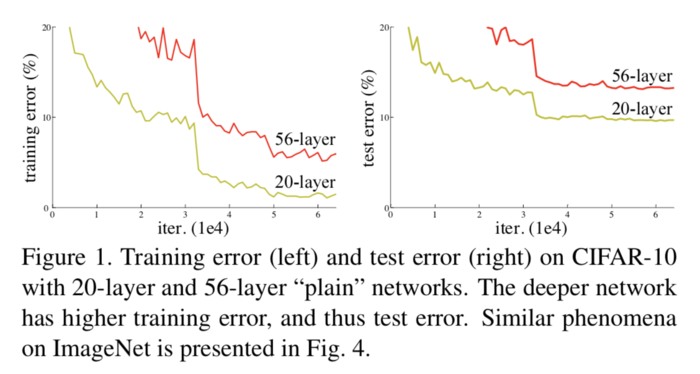
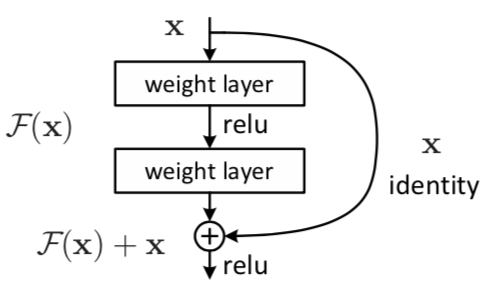
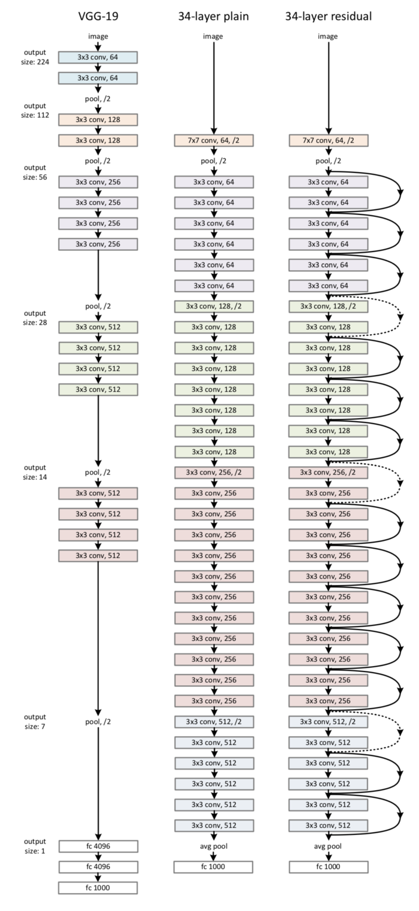
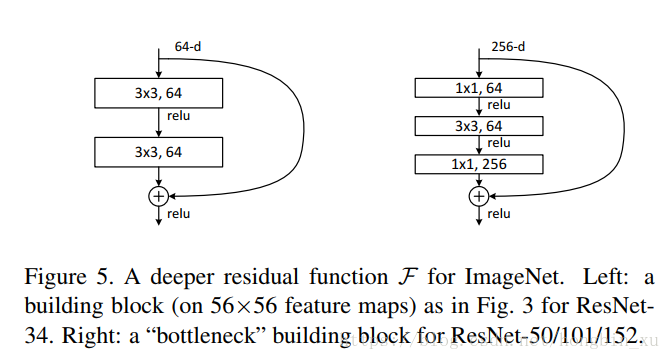

# 残差神经网络

参考整理自[残差网络](http://www.likecs.com/show-32693.html)

参考整理自[论文笔记：残差神经网络(ResNet v1)](https://blog.csdn.net/hongbin_xu/article/details/82932431)

## 残差含义

残差在数理统计中是指实际观察值与估计值（拟合值）之间的差。”“如果回归模型正确的话， 我们可以将残差看作误差的观测值。

更准确地，假设我们想要找一个 x，使得 f(x) = b，给定一个 x 的估计值 x_0，残差（residual）就是 b-f(x_0)，同时，误差就是 x-x_0。

即使 x 不知道，我们仍然可以计算残差，只是不能计算误差罢了。

## 残差网络含义

在了解残差网络之前，先了解下面这个问题。

Q1：神经网络越深越好吗？（Deeper is better？）
A1：如图所示，在训练集上，传统神经网络越深效果不一定越好。而 Deep Residual Learning for Image Recognition 这篇论文认为，理论上，可以训练一个 shallower 网络，然后在这个训练好的 shallower 网络上堆几层 identity mapping（恒等映射） 的层，即输出等于输入的层，构建出一个 deeper 网络。这两个网络（shallower 和 deeper）得到的结果应该是一模一样的，因为堆上去的层都是 identity mapping。这样可以得出一个结论：理论上，在训练集上，Deeper 不应该比 shallower 差，即越深的网络不会比浅层的网络效果差。

(plain network指的是没有使用 shortcut connection 的网络)

但为什么会出现图上这样的情况呢，随着层数的增多，训练集上的效果变差？这被称为退化问题（degradation problem），原因是随着网络越来越深，训练变得原来越难，网络的优化变得越来越难。理论上，越深的网络，效果应该更好；但实际上，由于训练难度，过深的网络会产生退化问题，效果反而不如相对较浅的网络。而残差网络就可以解决这个问题的，残差网络越深，训练集上的效果会越好。（测试集上的效果可能涉及过拟合问题。过拟合问题指的是测试集上的效果和训练集上的效果之间有差距。）

**残差网络在深层网络中存在梯度消失/梯度爆炸（vanishing/exploding gradients）**

归一初始化（normalized initialization）和中间归一化（intermediate normalization）在很大程度上解决了这一问题，它使得数十层的网络在反向传播的随机梯度下降（SGD）上能够收敛。

**训练深层网络时会出现退化（degrdation）**

随着网络深度的增加，准确率达到饱和（不足为奇）然后迅速退化。这一退化并不是由过拟合导致的，而是网络过深导致难以训练。如上图深层网络的训练和测试误差都比浅层网络的更高。

残差网络通过加入 shortcut connections，变得更加容易被优化。包含一个 shortcut connection 的几层网络被称为一个残差块（residual block），如下图所示。

## 残差块
如上图所示，x 表示输入，F(x) 表示残差块在第二层激活函数之前的输出，即 F(x) = W_2*sigma(W_1x)，其中 W_1 和 W_2 表示第一层和第二层的权重，sigma 表示 ReLU 激活函数。（这里省略了 bias。）最后残差块的输出是 sigma(F(x) + x)。
　　当没有 shortcut connection（即图 2 右侧从 x 到 \bigoplus 的箭头）时，残差块就是一个普通的 2 层网络。残差块中的网络可以是全连接层，也可以是卷积层。设第二层网络在激活函数之前的输出为 H(x)。如果在该 2 层网络中，最优的输出就是输入 x，那么对于没有 shortcut connection 的网络，就需要将其优化成 H(x) = x；对于有 shortcut connection 的网络，即残差块，最优输出是 x，则只需要将 F(x) = H(x) - x 优化为 0 即可。后者的优化会比前者简单。这也是残差这一叫法的由来。
　　
### 残差网络举例

上图最右侧就是就是一个残差网络。34-layer 表示含可训练参数的层数为34层，池化层不含可训练参数。图右侧所示的残差网络和中间部分的 plain network 唯一的区别就是 shortcut connections。这两个网络都是当 feature map 减半时，filter 的个数翻倍，这样保证了每一层的计算复杂度一致。

ResNet 因为使用 identity mapping，在 shortcut connections 上没有参数，所以图 3 中 plain network 和 residual network 的计算复杂度都是一样的，都是 3.6 billion FLOPs.
　　
## 为什么残差网络会work？
我们给一个网络不论在中间还是末尾加上一个残差块，并给残差块中的 weights 加上 L2 regularization（weight decay），这样图 1 中 F(x) = 0 是很容易的。这种情况下加上一个残差块和不加之前的效果会是一样，所以加上残差块不会使得效果变得差。如果残差块中的隐藏单元学到了一些有用信息，那么它可能比 identity mapping（即 F(x) = 0）表现的更好。

## shortcut连接
残差块通过shortcut连接实现。
恒等shortcuts（identity shortcuts）：要求两个输入的维度相同。

映射shortcuts（projection shortcuts）：如果两个输入的维度不同，可以给shortcut连接加上一个线性映射 W_s。

 
**shortcuts实现的三种选项：**
* 1.对增加的维度使用0填充，所有的shortcuts是无参数的
* 2.对增加的维度使用projection shortcuts，其它使用identity shortcuts
* 3.所有的都采用projection shortcuts

**三种选项相计较：**
* 2略好于1，可以认为是1中填充的0并没有进行残差学习。
* 3略好于2，可以将其归结于更多的projection shortcuts引入了更多的参数。
* 1、2、3几个模型的差距很小，说明了projection shortcuts对于解决退化（degradation）问题不是必须得。
* 为了减少复杂度和模型尺寸，不采用模型3，而是选择模型2。

## 残差网络结构

第一个 1 * 1 卷积负责减小维度，让中间的 3 * 3 卷积获得更少的通道数， 第二个 1 * 1 卷积负责增加维度。整个架构类似瓶颈，可以减少计算复杂度

## 训练细节

* 图像增强：从原始图像或水平翻转图像中随机采样一个224 * 224的crop。
* 图像预处理：减去均值。
* 卷积结构：每个卷积层后，都接一个batch normalization（BN）。
* 超参数：batch size为256；学习率为0.1，当测试集上的错误率平稳后就将学习率除以10；采用SGD，权值衰减设置为0.0001，动量为0.9；整个模型迭代60*10^4次；
* 测试时，融合多个模型的结果，分别计算多尺度图片的结果，对结果的评分取均值。（调整图像的大小使它的短边长度分别为 { 224 , 256 , 384 , 480 , 640 }）